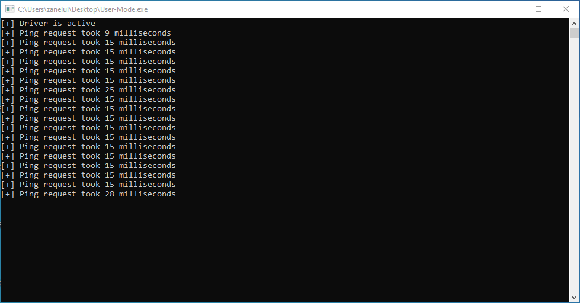

# SharedMemory
My attempt on making a communication system using shared memory concept.

## Information

### Communication
---

This communication system relys on the user-mode allocated memory. The kernel-mode can find this address dynamicly by simply pattern scanning for the global `AllocatedMemory` variable. Once found it can now do operations by copying the request information to the allocated memory.

### Speed
---

I have measured the speed using the clock time then getting the delta of it. The average response time was around 15 milliseconds

The speed was measured with the `PING` command, it may differ through different commands.